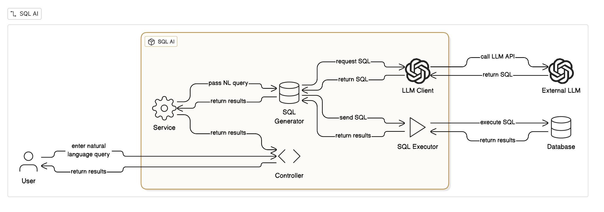

# SQL AI Assistant

A Spring Boot application that leverages OpenAI's GPT models to convert natural language questions into SQL queries and execute them against a PostgreSQL database. This project demonstrates secure integration of generative AI with relational databases, enabling intelligent data interactions while maintaining robust security practices.

## 🏗️ Architecture

The application follows a layered architecture pattern with clear separation of concerns:



## 🎥 Demo

Watch the demo video to see the SQL AI Assistant in action:

**[📹 Click here to view the demo video](support/Demo.mov)**

## 🚀 Features

- **Natural Language to SQL**: Ask questions in plain English and get SQL queries generated automatically
- **Query Execution**: Automatically executes generated SQL queries against PostgreSQL database
- **Results Visualization**: Beautiful, responsive UI to display query results in tabular format
- **Error Handling**: Comprehensive error handling for SQL generation and execution failures
- **Security**: API keys stored securely in environment variables
- **Docker Support**: Easy deployment with Docker Compose
- **Modern UI**: Clean, modern interface with dark mode support

## 🛠️ Tech Stack

- **Backend**: Spring Boot 3.5.7
- **AI Integration**: Spring AI 1.0.3 with OpenAI GPT-3.5-turbo
- **Database**: PostgreSQL 14
- **Frontend**: Thymeleaf, Bootstrap 5, Highlight.js
- **Build Tool**: Maven
- **Java Version**: 21
- **Containerization**: Docker & Docker Compose

## 📋 Prerequisites

Before you begin, ensure you have the following installed:

- Java 21 or higher
- Maven 3.6+
- PostgreSQL 14+ (or use Docker)
- Docker & Docker Compose (optional, for containerized deployment)
- OpenAI API Key ([Get one here](https://platform.openai.com/api-keys))

## 🔧 Installation & Setup

### Option 1: Local Development

1. **Clone the repository**
   ```bash
   git clone <repository-url>
   cd sqlAi
   ```

2. **Create `.env` file**
   ```bash
   cp .env.example .env
   ```
   Edit `.env` and add your OpenAI API key:
   ```
   OPENAI_API_KEY=your_openai_api_key_here
   ```

3. **Set up PostgreSQL Database**
   - Create a database named `spring_ai_db` (or update `application.yaml`)
   - Run the initialization script `spring_ai_data.sql` to populate sample data

4. **Update database configuration** (if needed)
   Edit `src/main/resources/application.yaml`:
   ```yaml
   spring:
     datasource:
       url: jdbc:postgresql://localhost:5432/spring_ai_db
       username: your_username
       password: your_password
   ```

5. **Build and run the application**
   ```bash
   mvn clean install
   mvn spring-boot:run
   ```

6. **Access the application**
   Open your browser and navigate to: `http://localhost:8080`

### Option 2: Docker Compose (Recommended)

1. **Clone the repository**
   ```bash
   git clone <repository-url>
   cd sqlAi
   ```

2. **Create `.env` file**
   ```bash
   cp .env.example .env
   ```
   Add your OpenAI API key to `.env`:
   ```
   OPENAI_API_KEY=your_openai_api_key_here
   ```

3. **Start the application**
   ```bash
   docker-compose up -d
   ```

4. **Access the application**
   Open your browser and navigate to: `http://localhost:8080`

## ⚙️ Configuration

### Environment Variables

Create a `.env` file in the project root with the following variables:

```env
OPENAI_API_KEY=your_openai_api_key_here
```

### Application Configuration

Key configuration in `src/main/resources/application.yaml`:

```yaml
spring:
  ai:
    openai:
      api-key: ${OPENAI_API_KEY}
      chat:
        options:
          model: gpt-3.5-turbo
  datasource:
    url: jdbc:postgresql://localhost:5432/spring_ai_db
    username: postgres
    password: postgres
```

## 📖 Usage

1. **Start the application** (using one of the methods above)

2. **Open the web interface** at `http://localhost:8080`

3. **Ask a question** in natural language, for example:
   - "Show all OpenAI models with price less than 0.01"
   - "List all models that support SQL"
   - "Top 3 cheapest models by output price"
   - "Models launched after 2023"

4. **View results**: The application will:
   - Generate SQL query from your question
   - Execute the query against the database
   - Display results in a formatted table

### Architecture Overview

The system is built using a **layered architecture** with the following components:

1. **Presentation Layer** (`controller/`)
   - `AskController`: Handles HTTP requests and responses
   - Implements Post-Redirect-Get (PRG) pattern for form submissions

2. **Service Layer** (`service/`)
   - `SqlQueryService`: Orchestrates the query processing workflow
   - `TextToSqlService`: Converts natural language to SQL using OpenAI
   - `SqlExecutorService`: Executes SQL queries against the database

3. **Data Access Layer**
   - Spring JDBC for database interactions
   - PostgreSQL database for data storage

4. **Configuration Layer** (`config/`)
   - `SpringAIConfig`: Configures Spring AI ChatClient bean

5. **Exception Handling** (`exception/`)
   - `GlobalExceptionHandler`: Centralized exception handling
   - Custom exceptions for different error scenarios

6. **Model Layer** (`model/`)
   - `QueryResult`: Data transfer object for query results

### Request Flow

1. User submits a natural language question via the web form
2. `AskController` receives the POST request
3. `SqlQueryService` processes the question:
   - `TextToSqlService` generates SQL using OpenAI
   - `SqlExecutorService` executes the SQL query
4. Results are formatted into `QueryResult` object
5. Controller redirects to home page with results (PRG pattern)
6. Thymeleaf template renders the results

### Security Considerations

- API keys stored in `.env` file (not committed to version control)
- Input validation and sanitization
- SQL injection protection through parameterized queries
- Error messages don't expose sensitive information

## 📁 Project Structure

```
sqlAi/
├── src/
│   ├── main/
│   │   ├── java/com/pruthvi/sqlAi/
│   │   │   ├── config/              # Configuration classes
│   │   │   │   └── SpringAIConfig.java
│   │   │   ├── controller/          # REST controllers
│   │   │   │   └── AskController.java
│   │   │   ├── exception/           # Exception handling
│   │   │   │   ├── GlobalExceptionHandler.java
│   │   │   │   ├── EmptyQuestionException.java
│   │   │   │   ├── SqlGenerationException.java
│   │   │   │   └── SqlExecutionException.java
│   │   │   ├── model/               # Data models
│   │   │   │   └── QueryResult.java
│   │   │   ├── service/             # Business logic
│   │   │   │   ├── Impl/
│   │   │   │   │   ├── SqlExecutorServiceImpl.java
│   │   │   │   │   ├── SqlQueryServiceImpl.java
│   │   │   │   │   └── TextToSqlServiceImpl.java
│   │   │   │   ├── SqlExecutorService.java
│   │   │   │   ├── SqlQueryService.java
│   │   │   │   └── TextToSqlService.java
│   │   │   └── SqlAiApplication.java
│   │   └── resources/
│   │       ├── application.yaml     # Application configuration
│   │       └── templates/
│   │           └── index.html       # Frontend template
│   └── test/                        # Test files
├── docker-compose.yml               # Docker Compose configuration
├── Dockerfile                       # Docker image definition
├── pom.xml                          # Maven dependencies
├── spring_ai_data.sql              # Database initialization script
├── .env.example                    # Environment variables template
└── README.md                       # This file
```

## 🔌 API Endpoints

| Method | Endpoint | Description |
|--------|----------|-------------|
| GET | `/` | Home page with query form |
| POST | `/ask` | Process natural language question and return results |
| GET | `/ask` | Redirects to home page (handles refresh scenarios) |


## 🤝 Contributing

Contributions are welcome! Please feel free to submit a Pull Request.

1. Fork the repository
2. Create your feature branch (`git checkout -b feature/AmazingFeature`)
3. Commit your changes (`git commit -m 'Add some AmazingFeature'`)
4. Push to the branch (`git push origin feature/AmazingFeature`)
5. Open a Pull Request

## 📝 License

This project is open source and available under the [MIT License](LICENSE).

## 👤 Author

**Pruthviraj Jadhav**

---

**Note**: Make sure to keep your `.env` file secure and never commit it to version control. The `.env` file is already included in `.gitignore`.

